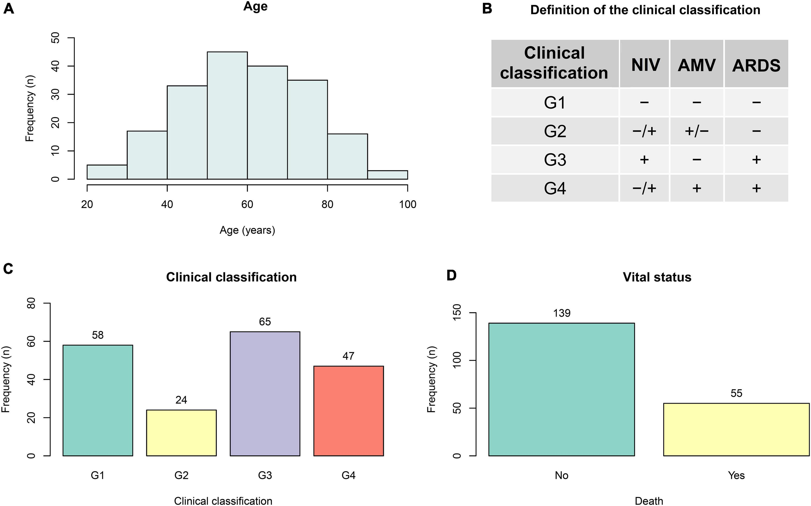
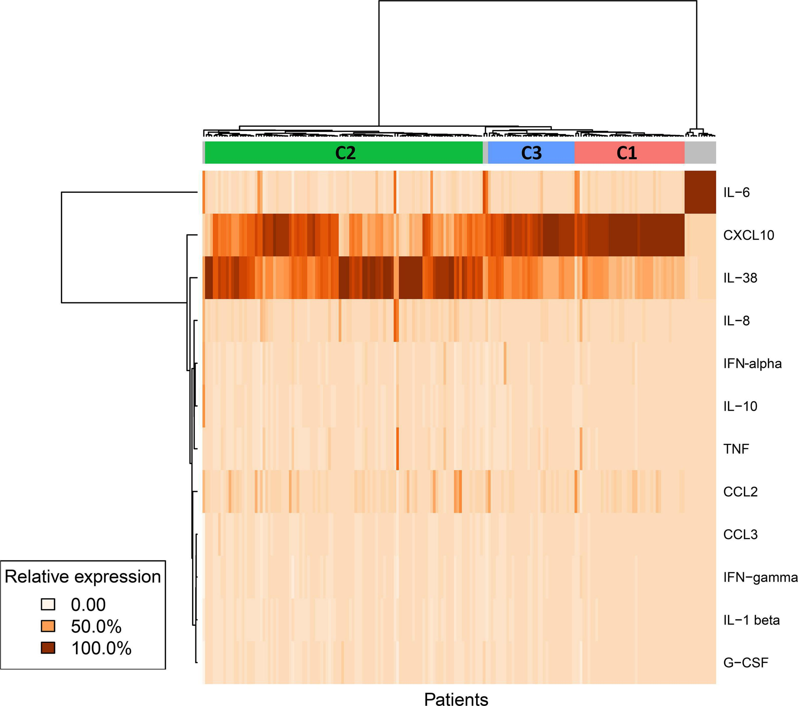

```{r setup, include=FALSE}
knitr::opts_chunk$set(echo = TRUE, warning = FALSE, message = FALSE)
```


# Introduction

In this session, the main aim is to perform two of the commonly executed steps in any Data Mining workflow: an Exploratory Dataset Analysis, in order to get to know the data, clean and prepare it, and try to find some first relation with the variables to work/predict; and to deal with basic visualization tasks, such as the building common plots like histograms, barplots or heatmaps, in a readable, and informative way. For both tasks we will use two datasets that were provided to us:

* Heart Disease Dataset: Originally contains 303 observations (patients) and 13 features, plus a code with the corresponding diagnostic of heart disease and the ID of the patient.

* Covid-19 Dataset: includes 18 features from clinical data (admission, symptoms, clinical status) for 214 patients. Additionally, multiple observations (445 in total) for each patient were provided concerning cytokine profiles and other hematologic parameters (not considered in this session).


```{r}
#Loads the needed libraries:

# For Ex 1:
library(tidyverse)
library(corrplot)

library(mlbench)
library("GGally")

# For Ex 2:

library(dplyr)
library(tidyr)
library(ggplot2)

library(readxl)
library(gtable)
library(data.table)

library(gridExtra)
library(grid)

library(patchwork)
library(stringr)

library(ComplexHeatmap)
library(circlize)

set.seed(123) # Set seed for reproducibility

```


# Exercise 1: Analysis of the Heart Disease Dataset 
Load the data from
[here](https://raw.githubusercontent.com/jpinero/DMI_2021/main/datasets/heart_disease_dataset.csv), and the description is [here](https://raw.githubusercontent.com/jpinero/DMI_2021/main/datasets/heart_disease_description.txt). 
The original dataset comes from [here](https://archive.ics.uci.edu/ml/datasets/Heart+Disease) and corresponds to the [processed cleveland data](https://archive.ics.uci.edu/ml/machine-learning-databases/heart-disease/processed.cleveland.data)

## Exploratory Data Analysis

**Perform an EDA on the dataset.**

Firstly, we load the data (note that we have to specify that na values are expressed as "?"). Originally, the dataset has 15 columns, but we remove the last one (which is just an increasing integer for ID) as we will not use it. Thus, this leaves us with 14 columns (13 features and the target, which determines if has heart pathology or not). Furthermore, there are 303 rows (corresponding to a patient each one).

Then, we perform a first glance to the dataset with `str()`, in which we see all the features involved (plus the target one, num). This is also useful, as we can see which categorical variables (encoded as integers) should be converted to factors.

```{r}

# Read file with correct delimiter (spaces)
heart_data <- read.csv("data/heart_disease_dataset.csv", sep = " ", header = TRUE, na.strings = c("?"))
heart_data <- heart_data[,1:14] #Remove ID column

# Check the loaded columns
cat("Number of features:", ncol(heart_data)-1, "\n")
cat("Number of patients:", nrow(heart_data), "\n")

# Explore dataset
cat("\nDataset structure:\n")
str(heart_data)
```

Before that, we have a look at `na` values. Looking per columns, we see that only two (`ca` and `thal`) contain `na` values, that is, only 6 patients from more than 300. Usually, more sophisticated methods should be used (such as data imputaton using the mean attribute or even Bayesian inference), or even manual introduction would be feasible in this particular case, but for simplicity, in this hands-on we will just ignore the patients with a missing value. Note that this is assumeable, as these 6 cases represent less than 2% of cases.

```{r}
# Check missing values per columns
cat("Number of missing values per column before cleaning:\n")
print(colSums(is.na(heart_data)))

# Omits rows with na
heart_data <- na.omit(heart_data)

# Check the loaded columns again
cat("\nNumber of features:", ncol(heart_data)-1, "\n")
cat("Number of patients:", nrow(heart_data), "\n")

# Check that now we do not have na
cat("\nTotal number of missing values after cleaning:", sum(colSums(is.na(heart_data))))
```
Now we can proceed in converting these categorical columns into factors. We check again that now these are introduced as factors

```{r}
cont_cols <- c(1, 4, 5, 8, 10)  # Corresponding to age, trestbps, chol, thalach and oldpeak
cat_cols <- setdiff(1:ncol(heart_data), cont_cols)  # The rest are categorical

heart_data_num <- heart_data #Keep the dataset in numerical if needed later
heart_data[cat_cols] <- lapply(heart_data[cat_cols], as.factor)

str(heart_data)
```
With the dataset cleaned, we can now proceed in obtaining a summary of the dataset. Note that for the categorical values, a frequency count is obtained; for the rest, a basic statistical analysis is presented (range, quartiles and mean).

```{r}
cat("Dataset summary:\n")
summary(heart_data)
```

As a first exploratory approach, we will plot visually each of the columns using a barplot if categorical, or histogram if continuous. This will show us in a visual way the distribution of each of the variables individually (univariate EDA).

```{r}

#Custom widths for histograms
hist_bins <- c(10, 10, 20, 10, 0.5)

# Function to generate barplots (categorical) or histograms (continuous)
plot_list <- lapply(1:ncol(heart_data), function(i) {
  col_name <- names(heart_data)[i]
  
  if (i %in% cont_cols) {
    ggplot(heart_data, aes(x = .data[[col_name]])) + 
      geom_histogram(binwidth = hist_bins[match(i, cont_cols)], fill = "steelblue", color = "black") +
      ggtitle(col_name)
  } else {
    ggplot(heart_data, aes(x = .data[[col_name]])) + 
      geom_bar(fill = "steelblue", color = "black") +
      ggtitle(col_name)
  }
})

# Arrange plots in a grid
grid.arrange(grobs = plot_list, ncol = 4)

```

For the continuous variables (age, trestbps, chol, thalach and oldpeak), a Q-Q plot is also a good way to see if these follow a normal distribution. In particular, we see that age, chol and thalach are close to follow a normal distribution (although a proper statistical test, such as Shapiro-Wilk, would be needed to extract solid conclusions). However, trestbps and especially oldpeak (due to the presence of multiple zeros) are far from an ideal normal distribution.

```{r}

# Generate Q-Q plots for selected continuous columns
qq_plots <- lapply(cont_cols, function(i) {
  col_name <- names(heart_data)[i]
  ggplot(heart_data, aes(sample = .data[[col_name]])) +
    stat_qq() + 
    stat_qq_line() + 
    ggtitle(paste(col_name))
})

# Arrange plots in a grid
grid.arrange(grobs = qq_plots, ncol = 3)
```
Switching to a bivariate EDA, with `ggpairs` we can easily extract scatterplots for each pair of features. In this case, considering only the continuous ones (it has less sense to do a scatter plot with categorical ones). This plot is also useful, as it gives the correlation between variables and if they are significant. In our case, we find that some of they are indeed, particularly the age, which has some degree of correlation with all the rest. For instance, the highest absolute value corresponds to the correlation between age and thalach, with about -0.4 (negative correlation). This plot would help us understand better how variables relate each other pairwise.


```{r}
#Scatter plots pairwise:
ggpairs(heart_data[,cont_cols])

```

We can also extract the correlations in a easy, visual way with `corrplot`. We observe similar findings, with age with some kind of correlation (positive or negative) with the other features.
 
```{r}
res <- cor(heart_data[, cont_cols]) #correlation matrix

#Correlation plot:
corrplot(res, type = "upper", order = "hclust",
 tl.col = "black", tl.srt = 45)
```

If nevertheless we are interested in comparing relations between continuous and categorical variables, we have many options such as boxplots. These will plot the distribution values of the continuous variables, for each group of the categorical variable. For instance, here we plot the distribution of the rest blood pressure (trestbps) for both female and male.

```{r}
#Boxplot with one categorical group
ggplot(heart_data, aes(x = interaction(sex), y = trestbps)) + 
  geom_boxplot(fill = "lightblue", color = "black") + 
  labs(title = "Boxplot of Rest BPS respect to gender", 
       x = "Gender", 
       y = "Blood Pressure (mmHg)") + 
  scale_x_discrete(labels = c("Female", "Male")) + 
  theme(axis.text.x = element_text(angle = 0, hjust = 1))

```

And we can even compare multiple groups with boxplots. For instance, here we obtain the cholesterol distribution for each gender and fasting blood sugar (High, Low) groups. This shows that for low FBS, female and male cholesterol distribution are comparable, with similar means. But for high FBS, the cholesterol is notably higher for Female than Male.

Note that this and prior cases are just examples, and we could design boxplots for any pair of variables we needed in the study.

```{r}
#Boxplot with two categorical groups
ggplot(heart_data, aes(x = interaction(sex, fbs), y = chol)) + 
  geom_boxplot(fill = "lightblue", color = "black") + 
  labs(title = "Boxplot of Cholesterol respect to Fasting Blood Sugar and Gender", 
       x = "Gender:FBS", 
       y = "Cholesterol (mg/dL)") + 
  scale_x_discrete(labels = c("F:Low", "M:Low", "F:High", "M:High")) + 
  theme(axis.text.x = element_text(angle = 45, hjust = 1))
```

Finally, another useful process during EDA is the detection of the outliers. Here, we will use a simple approach and determine as outliers the samples which are below 1.5·IQR 1st quartile, or above 1.5·IQR the 3rd quartile. In a real study, these outliers would be needed to be treated properly, but as a preliminary work, we will just leave the outliers for simplicity; something that we can assume as in any column the outliers exceed the 5% of the total samples.

```{r}
# Function to count outliers using the IQR method
count_outliers <- function(x) {
  Q1 <- quantile(x, 0.25, na.rm = TRUE)  # First quartile (25%)
  Q3 <- quantile(x, 0.75, na.rm = TRUE)  # Third quartile (75%)
  IQR_value <- Q3 - Q1  # Interquartile range
  lower_bound <- Q1 - 1.5 * IQR_value
  upper_bound <- Q3 + 1.5 * IQR_value
  
  # Return the count of outliers
  return(sum(x < lower_bound | x > upper_bound, na.rm = TRUE))
}

# Count outliers for each continuous column
outlier_counts <- sapply(cont_cols, function(i) {
  count_outliers(heart_data[[i]])
})

# Store results in a data frame
outlier_summary <- data.frame(Column = names(heart_data)[cont_cols], OutlierCount = outlier_counts)

# Print the summary of outliers
print(outlier_summary)

```
## Visualizations

**Create visualizations in order to show which variables seem to be more associated with heart disease.**

First of all, it is interesting to plot again the distribution of the heart disease groups. In the documentation, it is only stated that 0 refers to a less than 50% narrowing, while 1 refers to a more severe condition (higher than 50% narrowing). However, in the dataset the patients are assigned in more groups, from 0 to 4. Thus, due to the lack of information, we will assume for this exercise that groups from 2 to 4 refer to other levels of artery narrowing. In any case, we observe that patients in group 0 are the majority of the dataset, while the ones from group 4 are in a minority.


```{r}
heart_data$numrev <- factor(heart_data$num, levels = 4:0) #Reversed factors for visualization purposes

#Barplot:
ggplot(heart_data, aes(x = num, fill = numrev)) +
  geom_bar() +
  labs(title = "Target Variable Distribution",
       x = "Heart Disease Status", y = "Count")
```

Firstly, for the continuous variables, it may be useful to plot the histograms, but this time stacking vertically the different groups. This allows to see abnormal distribution within a certain group and for a certain variable. For instance, we observe that the ST depression in exercise relative to rest (oldpeak) tends to be lower for patients in group 0, but higher values correspond in a majority for the more severe conditions (groups 1 to 4). Another interesting finding from here is that the patients from group 4 are mostly concentrated in the 55-65 age interval, something that also happens in less intensity for groups 1 and 2.

```{r}

#Custom widths for histograms
hist_bins <- c(10, 10, 20, 10, 0.5)

# Function to generate histograms
plot_list <- lapply(cont_cols, function(i) {
  col_name <- names(heart_data)[i]
  
  #Histogram
  ggplot(heart_data, aes(x = .data[[col_name]], fill = numrev)) + 
      geom_histogram(binwidth = hist_bins[match(i, cont_cols)], position = "stack", color = "black") +
      ggtitle(col_name)
  
})

# Arrange plots in a grid
grid.arrange(grobs = plot_list, ncol = 3)

```
Note that, for the continuous variables, another possible representation is by boxplots, which allows to see differences on the distributions. For exemplification, following we plot the boxplots only by groups, but as we showed in the previous section, multiple group comparison can be done. 

In our particular case, we can observe that groups from 1 to 4 tend to include patients with higher ages than in group 0, although this last has more variability. The Resting Blood Pressure is comparable from groups 0 to 3, but the mean of group 4 is slighty higher. Cholesterol values are comparable between groups, at least by visual inspection. On the other hand, the maximum heart rate (thalach) seems to be larger for group 0 compared to the other groups, contrarily to the ST depression due to exercise compared to rest (oldpeak), which presents lower values in group 0 compared to others (group 1 is also lower compared to groups 2-4). Thus, boxplots are proven to be a very visual way to do comparisons between groups, although note that in order to extract proper conclusions, a deeper analysis (including statistical tests) would be required.

```{r}

# Function to generate scatter plots
plot_list <- lapply(cont_cols, function(i) {
  col_name <- names(heart_data)[i]
  
  #Boxplots
  ggplot(heart_data, aes(x = num, y = .data[[col_name]], fill = numrev)) +
  geom_boxplot() +
  ggtitle(col_name)
  
})

# Arrange plots in a grid
grid.arrange(grobs = plot_list, ncol = 3)

```


The prior plots allows to visualize each variable individually. It would also be interesting to see how variables interact each other, something that we can observe with scatterplots, for instance, by plotting one variable in front of another. Following we plot the age vs. the other continuous variables. It is difficult to see clear clusters of patients groups, but some patterns can be observed. For instace, we see a slight tendence in which the maximum heart beat rate is reduced by age in group 0, but this tendence is not so clear in the other groups.

```{r}

# Generates scatterplots (only for continuous, vs. age)
plot_list <- lapply(c(4, 5, 8, 10), function(i) {
  col_name <- names(heart_data)[i]
  
  # Scatterplots
  ggplot(heart_data, aes(x = age, y = .data[[col_name]], color = numrev)) +
    geom_point(alpha = 1, size = 2) +
    ggtitle(paste(col_name, "vs. age"))
  
})

# Arrange plots in a grid
grid.arrange(grobs = plot_list, ncol = 2)

```

We can do the prior representation for the other continuous variables. For instance, here we plot them vs. the maximum heart rate. However, it is again difficult to see clear clusters and a deeper analysis on them would be needed to extract solid conclusions.

```{r}

# Generates scatterplots (only for continuous, vs. thalach)
plot_list <- lapply(c(1, 4, 5, 10), function(i) {
  col_name <- names(heart_data)[i]
  
  # Scatterplots
  ggplot(heart_data, aes(x = thalach, y = .data[[col_name]], color = numrev)) +
    geom_point(alpha = 1, size = 2) +
    ggtitle(paste(col_name, "vs. Max. Heart Rate"))
  
})

# Arrange plots in a grid
grid.arrange(grobs = plot_list, ncol = 2)

```

Until now, we worked on continuous variables. We can also extract valuable information from the categorical variables. In this case, we plot the proportions within each group, representing each bar one class of the categorical variable. This allows to see if, for different classes, the relative proportion of groups changes or not: this could indicate that such variable has an effect on the heart disease outcome. Thus, some variables present comparable proportions (such as fasting blood sugar), but in others we find attention-catching changes.

For instance, the proportion of Female in healthy conditions is higher compared to male, which presents larger proportions on the other groups. Concerning the chest pain, patients with pain present similar proportions, although the asymptomatic ones present a larger proportion of groups 1-4 compared to group 0. Among other interesting factors, the proportion of healthy patients in which exercise did not induce angine is higher than in the ones that indeed produced angina, which would be expectable. Furthermore, the proportion of healthy patients is higher in fluoroscopies that did not color major vessels, and decreases (while the proportion of other groups increase) as the number of coloured vessels increase.


```{r}

# Function to generate barplots (categorical)
plot_list <- lapply(head(cat_cols,-2), function(i) {
  col_name <- names(heart_data)[i]
  
  # Barplots
  ggplot(heart_data, aes(x = .data[[col_name]], fill = numrev)) +
    geom_bar(position = "fill") +
      ggtitle(col_name)
  
})

# Arrange plots in a grid
grid.arrange(grobs = plot_list, ncol = 3)

```

Thus, to sum up, in this section we did a first instance visual analysis on the variables that may have an effect on the heart disease condition. Among them, continuous variables such as age, maximum heart rate or the shape of the exercise-derived ECG when compared to rest seem to play a role, others' like cholesterol or resting blood pressure effect remains unclear. Among categorical variables, gender, diagnosed chest pain, the induction of angina through exercise or the findings in fluorscopy also seem to play a role. In any case, we insist again in the idea that these findings should be taken qualitatively, and in a real analysis these should be followed by proper statistical tests.


# Exercise 2: Difference in mortality rates in hospitalized COVID-19 patients 
Using the supplementary material from the [Difference in mortality rates in hospitalized COVID-19 patients identified by cytokine profile clustering using a machine learning approach: An outcome prediction alternative](https://www.frontiersin.org/articles/10.3389/fmed.2022.987182/full), perform the following tasks

## Figure 1

**Reproduce Figure 1 from the publication.**

We are asked to reproduce the following figure from the proposed article:




Firstly, we load the data and change the names of the columns for a better management.

```{r}
data <- read_excel("data/mortality_rates_covid19.xlsx", col_names = TRUE) #Load data

#We change names to more accessible ones
setnames(data, 
         old = c('ARDS Diagnosis','Use of NIV','Use of AMV', 'Days with ARDS', 'Days with NIV', 'Days with AMV'), 
         new = c('ARDS','NIV','AMV','daysARDS', 'daysNIV', 'daysAMV'))
```

As can be seen, the figure to reproduce is formed by four subplots on a 2x2 grid. We will proceed to build each of the subplots of the figure. For the first one (A), we have an histogram of the age of the patients, showing the absolute frequency on the dataset. We can obtain this histogram simply with ```ggplot2``` package.

```{r}
#Histogram:
plotA <- ggplot(data, aes(x = Age)) +
  geom_histogram(boundary = 20, binwidth = 10, fill = "lightblue", color = "black", size=1.1) +
  labs(title = "Age\n", x = "\nAge (years)", y = "Frequency (n)\n", fontsize = 40) + theme_minimal() +
  theme(panel.grid = element_blank(),
        axis.title.x = element_text(size = 12, vjust = 2),  # Adjust x axis label size and distance
        axis.title.y = element_text(size = 12, vjust = 0),  # Adjust y axis label size and distance
        axis.text.x = element_text(size = 12),  # Change x axis tick labels font size
        axis.text.y = element_text(size = 12),
        axis.line = element_line(color = "black", size=1.1),  # Adds axis lines
        axis.ticks = element_line(color = "black", size=1.1),
        axis.ticks.length = unit(0.3, "cm"),
        plot.title = element_text(hjust = 0.5, size = 15, face = "bold"))
```


The B plot is actually the table that determines the criteria to classify patients on the different clinical groups concerning the NIV, AMV and ARDS status. Thus, we introduce the criteria from the paper manually on a dataframe, and convert it into a table.

```{r}

#Dataframe with the criteria:
groups_df <- data.frame(
  Clinical = c("G1", "G2", "G3", "G4"),
  NIV   = c("–", "–/+", "+", "–/+"),
  AMV   = c("+", "+/–", "–", "+"),
  ARDS   = c("–", "–", "+", "+")
)

#Build the table
colnames(groups_df) <- c("Clinical classification", "NIV", "AMB", "ARDS")
colnames(groups_df ) <- sapply(lapply(colnames(groups_df), strwrap, width=1), paste, collapse="\n") # string wrap long names    
tableB <- tableGrob(groups_df , rows = NULL)
tableB$widths <- unit(c(2, 1, 1, 1), "null")  # Adjust widths for each column

#Convert to grob to be able to insert it to the plot grid:
title_grob <- textGrob("Definition of the clinical classification", gp = gpar(fontsize = 13, fontface = "bold"))
tableB <- gtable_add_rows(tableB, heights = grobHeight(title_grob) + unit(15,'mm'), pos = 0)
tableB <- gtable_add_grob(tableB, title_grob, 2, 1, 1, ncol(tableB), clip = "off")

```


For the C plot, which is a bar plot showing the frequency on each group, we need to firstly classify the patients on the different groups. We can do that with ```if``` and ```else``` clauses. Previously, we need to preprocess the ARDS, NIV and AMV columns in case of values that are not Yes/No (less than 3 per column). For simplicity, we assign to these the majority value in the column. Then we can codify each of the patient in a group from 1 to 4, except these patients (in a minority) which do not belong to any group under the prior criteria (assigned with a 0). Finally, we can compute the frequency of each of the groups and build a barplot with ```ggplot2```.

```{r}

#Preprocess the columns (correct the non-valid numbers)
ARDS <- data$ARDS
daysARDS <- data$daysARDS
ARDS <- ifelse(ARDS == "Yes", "Yes", ifelse(ARDS == "No", "No", ifelse(daysARDS == 0, "No", "Yes")))

NIV <- data$NIV
daysNIV <- data$daysNIV
NIV <- ifelse(NIV == "Yes", "Yes", ifelse(NIV == "No", "No", ifelse(daysNIV == 0, "No", "Yes")))

AMV <- data$AMV
daysAMV <- data$daysAMV
AMV <- ifelse(AMV == "Yes", "Yes", ifelse(AMV == "No", "No", ifelse(daysAMV == 0, "No", "Yes")))

# Creates group vector under the conditions
group_vect <- ifelse(NIV == "No" & AMV == "No" & ARDS == "No", 1, 
              ifelse(NIV == "No" & AMV == "Yes" & ARDS == "No", 2,
              ifelse(NIV == "Yes" & AMV == "No" & ARDS == "No", 2,
              ifelse(NIV == "Yes" & AMV == "No" & ARDS == "Yes", 3,
              ifelse(AMV == "Yes" & ARDS == "Yes", 4, 0)))))

#Computes frequencies and inserts on a dataframe
freqs_vect <- c(sum(group_vect==1), sum(group_vect==2), sum(group_vect==3), sum(group_vect==4))
class_df <- data.frame(
  group = c("G1", "G2", "G3", "G4"),
  frequency = freqs_vect)

#Bar plot:
plotC <- ggplot(class_df, aes(x = group, y = frequency, fill = group)) +
  geom_bar(stat = "identity", color = "black", size = 1.1) +
  labs(title = "Clinical Classification", x = "\nClinical classification", y = "Frequency (n)\n") +
  scale_fill_manual(values = c("#66c2a5", "#ffffb3", "#8da0cb", "#fc8d62")) +
  theme_minimal() +
  geom_text(aes(label = freqs_vect), stat = "identity", vjust = -0.5, size = 4) +
  scale_y_continuous(limits = c(0, 80)) +
  theme(legend.position = "none",
        panel.grid = element_blank(),
        axis.title.x = element_text(size = 12, vjust = 2),  # Adjust x axis label size and distance
        axis.title.y = element_text(size = 12, vjust = 0),  # Adjust y axis label size and distance
        axis.text.x = element_text(size = 12),  # Change x axis tick labels font size
        axis.text.y = element_text(size = 12),
        axis.line = element_line(color = "black", size=1.1),  # Adds axis lines
        axis.ticks = element_line(color = "black", size=1.1),
        axis.ticks.length = unit(0.3, "cm"),
        plot.title = element_text(hjust = 0.5, size = 15, face = "bold"))
```

Finally, for plot D (another barplot but on whether the patient is dead or alive), we follow a similar workflow as before: we preprocess the Death column for non-valid values (assign the majoritary value, "No" in this case), we compute the frequencies and plot with ```ggplot2``` package.

```{r}
#Preprocess the columns (correct the non-valid numbers)
deaths <- data$Death
deaths <- ifelse(deaths == "Yes", "Yes", ifelse(deaths == "No", "No", "No"))

#Computes frequencies and inserts on a dataframe
freqsD_vect <- c(sum(deaths=="No"), sum(deaths=="Yes"))
death_df <- data.frame(
   group = c("No", "Yes"),
   frequency = freqsD_vect)

#Bar plot:
plotD <- ggplot(death_df, aes(x = group, y = frequency, fill = group)) +
  geom_bar(stat = "identity", color = "black", size = 1.1) +
  labs(title = "Vital status", x = "\nDeath", y = "Frequency (n)\n") +
  scale_fill_manual(values = c("#66c2a5", "#ffffb3")) +
  theme_minimal() +
  geom_text(aes(label = freqsD_vect), stat = "identity", vjust = -0.5, size = 4) +
  scale_y_continuous(limits = c(0, 180)) +
  theme(legend.position = "none",
        panel.grid = element_blank(),
        axis.title.x = element_text(size = 12, vjust = 2),  # Adjust x axis label size and distance
        axis.title.y = element_text(size = 12, vjust = 0),  # Adjust y axis label size and distance
        axis.text.x = element_text(size = 12),  # Change x axis tick labels font size
        axis.text.y = element_text(size = 12),
        axis.line = element_line(color = "black", size=1.1),  # Adds axis lines
        axis.ticks = element_line(color = "black", size=1.1),
        axis.ticks.length = unit(0.3, "cm"),
        plot.title = element_text(hjust = 0.5, size = 15, face = "bold"))
```

With the four subplots built, we are left on arranging them on a 2x2 grid. Previously, we need to add the subplot labels (A, B, C, or D) with Grob. Note that the final style details (exact position, linewidth,...) may not perfectly match the original figure, but we wanted to prioritise to present the same information on a reasonably similar arrangement.

```{r}

letterA <- textGrob("A", x = 0.05, y = 20, gp = gpar(fontsize = 15, fontface = "bold"))
letterB <- textGrob("B", x = 0, y = 2.9, gp = gpar(fontsize = 15, fontface = "bold"))
letterC <- textGrob("C", x = 0.05, y = 20, gp = gpar(fontsize = 15, fontface = "bold"))
letterD <- textGrob("D", x = 0, y = 20, gp = gpar(fontsize = 15, fontface = "bold"))

grid.arrange(arrangeGrob(plotA, letterA, heights = c(1, 0.05)), 
             arrangeGrob(tableB, letterB, heights = c(1, 0.5)),
             arrangeGrob(plotC, letterC, heights = c(1, 0.05)), 
             arrangeGrob(plotD, letterD, heights = c(1, 0.05)), ncol=2)


```

## Figure 2

**Reproduce Figure 2 from the publication but instead of representing the clusters in the annotation, represent the groups (G1 to G4).**

We are asked to reproduce the following figure from the proposed article:



Firstly, we read and pre-process the data (renaming columns and filling missing data, IDs in this case as only appears for the first occurrence on each patient).

```{r}
# Read excel:
df <- read_excel("data/gene_expression.xlsx", col_names = TRUE, na=c("NI", "ND"), skip = 1) #skip 1st line (not header)

colnames(df)[1:2] <- c("ID", "Day") # Rename first two columns for clarity
df$ID <- str_extract(df$ID, "\\d+$")  # Extract only numbers from Patient_ID

# Fill missing Patient_ID values downwards
df <- df %>%
  fill(ID, .direction = "down")
```

Besides, we select only the columns corresponding to cytokines. There, as we have multiple temporal registers for each patient, we take the median value of the timeseries as an approximation. Next, as we will need it following, we also add clinical data (Group, Gender, Vital Status) to the cytokine values. Finally, we scale (to make them comparable) and transpose (to match the Heatmap requirements) the cytokine data, and remove the nan values.

```{r}
cytokine_cols <- colnames(df)[3:14]  # Select only cytokine-related columns
df[cytokine_cols] <- lapply(df[cytokine_cols], as.numeric) # Convert numeric columns

# Compute median per patient across time points
df_median <- df %>%
  group_by(ID) %>%
  summarise(across(all_of(cytokine_cols), median, na.rm = TRUE))  # Median ignoring NA

#Builds clinical info dataframe
df_ex1 <- data.frame(ID = data$ID, Group = group_vect, Gender = data$Gender, Status = data$Death)
df_ex1 <- distinct(df_ex1, ID, .keep_all = TRUE)
df_ex1$ID <- str_extract(df_ex1$ID, "\\d+$")  # Keep only trailing numbers

#Merges cytokine with clinical info
df_median <- inner_join(df_ex1, df_median, by = "ID")
df_median <- df_median[order(df_median$Group),] #We order by groups, so appear ordered in the annotation

#Select only cytokine values (scaled) and remove nans (assign 0)
cytokine_data <- t(scale(df_median[,5:16]))#*100/max(df_median[,3:14], na.rm=TRUE)
cytokine_data[is.na(cytokine_data)] = 0 
```

Then, we are ready to build the Heatmap with `ComplexHeatmap` package. To do so, we assign colors for the groups and define the annotation that will go at the top, and finally introduce the cytokine matrix as the input to retrieve the Heatmap. Note that the Heatmap is not the same as the original for several reasons: firstly, they express the cytokine profiles in terms of a reference value, which we do not have at our disposal (we are expressing the scaled values, only); besides, we set the color scale approximately; finally, they sort the values by clusters: here we are doing it by groups, which explains a different distribution on the high/low values. In that sense, note that we also did not include the clustering of the columns, as this would disorder the samples by groups (clustering can be easily set as True as an argument of the plotting function).


```{r}

# Define colors for patient groups
group_colors <- c("0" = "grey", "1" = "#a5ddff", "2" = "#59c0ff", "3" = "#4fa9df", "4" = "#2e50f9")

# Create column annotation for patient groups
ha <- HeatmapAnnotation(Group = df_median$Group, 
                        col = list(Group = group_colors),
                        annotation_legend_param = list(title = "Patient Group"))


# Generate Heatmap (no column clustering and names)
Heatmap(cytokine_data, 
        name = "Expression", 
        top_annotation = ha,  # Annotate patients (columns) 
        col = colorRamp2(c(-1, 0.5, 2), c("#FFF5EB", "#FE9D53", "#8D2C03")), # Color scale
        cluster_rows = TRUE,  # Enable cytokine clustering
        cluster_columns = FALSE,  # Disable patient clustering
        show_row_names = TRUE,  # Keep cytokine names visible
        show_column_names = FALSE)  # Hide patient names


```

## Improved Figure 2

**Improve figure 2 of the publication. Add a second annotation with information of death and a third one with information of gender.**

As a first step, we convert the Vital Status, Group and Gender as factors, needed to do the annotation. As before, we sort the dataframe by Group, Status and Gender to have them visually ordered in the Heatmap.

```{r}

df_median$Status <- replace(df_median$Status, is.na(df_median$Status), "No") #Assign No to na values

# Conversion to factors:
df_median$Group <- factor(df_median$Group, levels = c("0", "1", "2", "3", "4"))
df_median$Status <- factor(df_median$Status, levels = c("No", "Yes"))
df_median$Gender <- factor(df_median$Gender, levels = c("M", "F"))  

# Sort the dataframe
df_ordered <- df_median %>%
  arrange(Group, Status, Gender)

```

And then, we proceed exactly as in the previous section, but defining colors for the Vital Status and Gender classes as well. Note that we ordered Vital Status within each Group class, and Gender within each Vital Status class (but order could be defined differently, depending on the needs).

```{r}

# Define colors for patient groups, vital status and gender
group_colors <- c("0" = "grey", "1" = "#a5ddff", "2" = "#59c0ff", "3" = "#4fa9df", "4" = "#2e50f9")
status_colors <- c("No" = "white", "Yes" = "black")
gender_colors <- c("M" = "#ff9983", "F" = "#aeff83")

# Create column annotation for patient groups
ha <- HeatmapAnnotation(Group = df_ordered$Group,
                        Status = df_ordered$Status,
                        Gender = df_ordered$Gender,
                        col = list(Group = group_colors, Status = status_colors, Gender = gender_colors),
                        annotation_legend_param = list(Group = list(title = "Patient Group"),
                                                       Status = list(title = "Survival Status"),
                                                       Gender = list(title = "Gender")))

# Generate Heatmap (no column clustering and names)
Heatmap(cytokine_data, 
        name = "Expression", 
        top_annotation = ha,  # Annotate patients (columns) 
        col = colorRamp2(c(-1, 0.5, 2), c("#FFF5EB", "#FE9D53", "#8D2C03")), # Color scale
        cluster_rows = TRUE,  # Enable cytokine clustering
        cluster_columns = FALSE,  # Disable patient clustering
        show_row_names = TRUE,  # Keep cytokine names visible
        show_column_names = FALSE)  # Hide patient names


```


# session info {.unnumbered}

```{r, results='asis',  echo=FALSE, message=FALSE }
sessionInfo()
```
